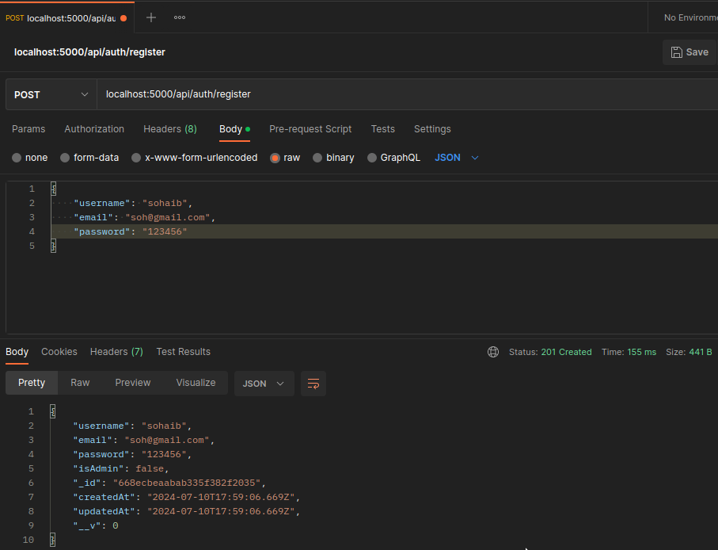
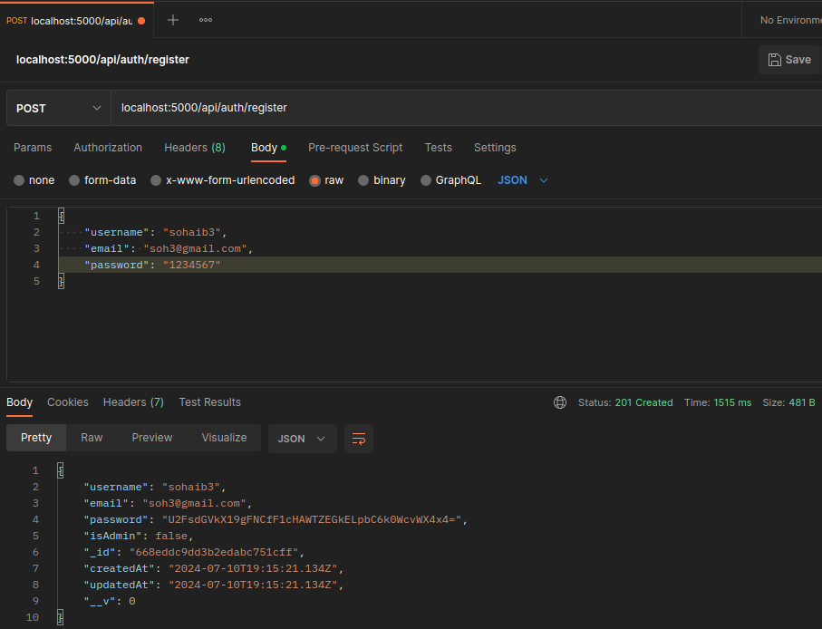
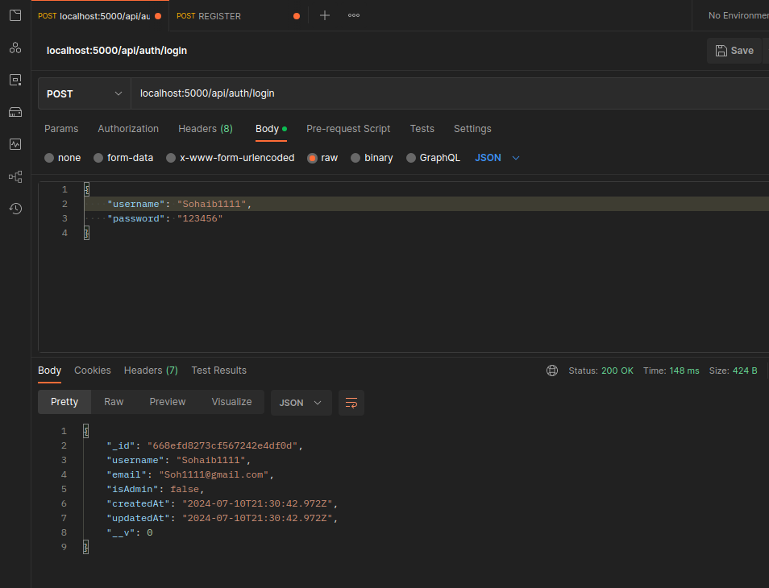
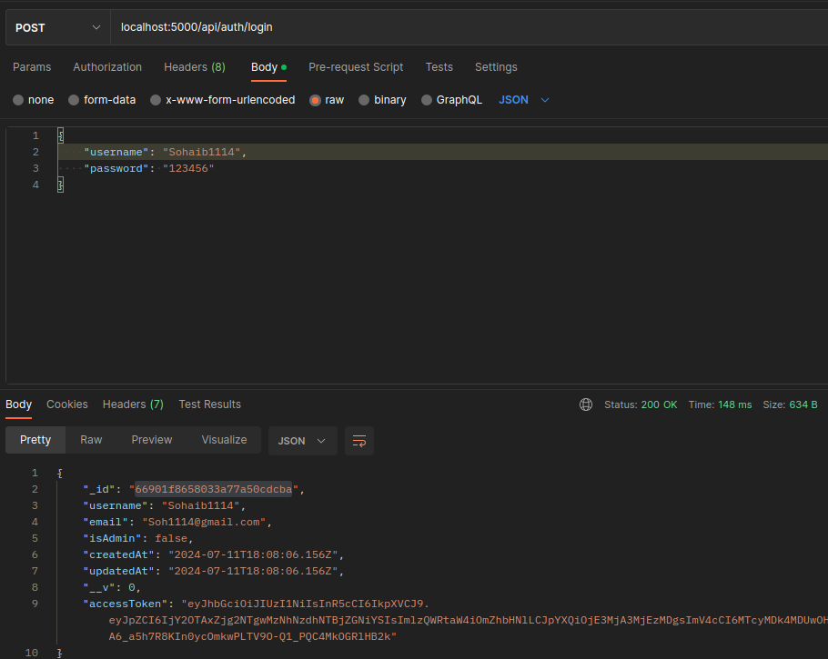
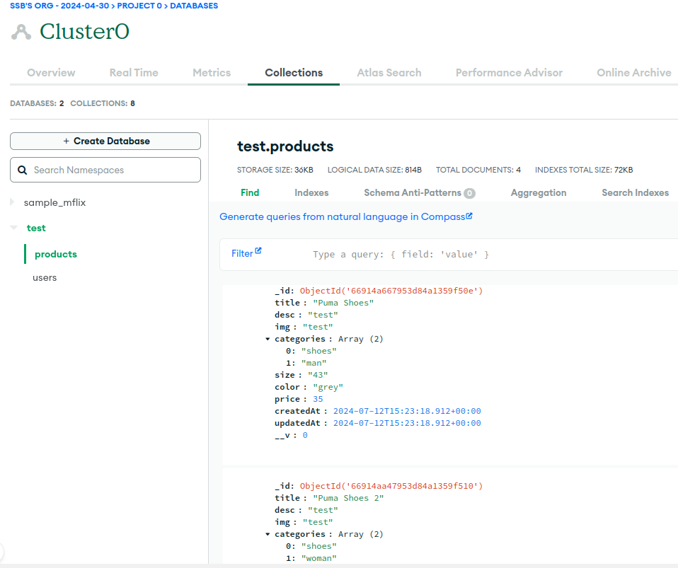

## Development Progress

In this section, I'm sharing some screenshots taken while I was working on and building this web application, showing how I improved it over time.

### Testing
-Auth Route - PostmanTest

-Encrypted Password with AES - PostmanTest

-Hide Password AES - PostmanTest

-Authentication using JSON Web Tokens (JWT) - PostmanTest

-Add Product - MongoDB

